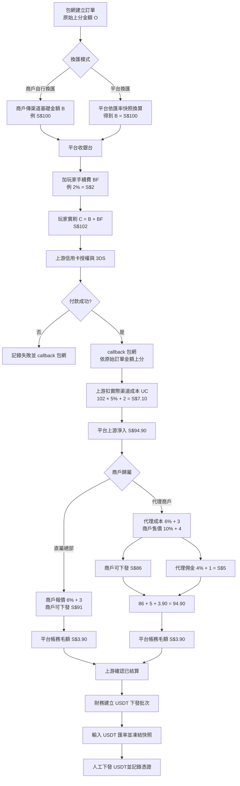

# 信用卡代收與代理結算平台規格書

文件版本：0.2 Draft
最後更新：2026-10-02（Asia/Taipei）
文件狀態：討論草案，尚未進入開發基線

## 1. 文件目的

本文件定義包網商戶、信用卡渠道、本平台、代理及財務結算之間的主要流程、金額模型、帳本、權限及待確認事項。

內容狀態分為：

- **已確認**：利害關係人已明確同意。
- **需求草案**：產品希望支援，但細節仍需確認。
- **建議方案**：為避免帳務或技術問題提出，確認後才能成為正式需求。

## 2. 系統定位

本平台是介於包網商戶與上游信用卡金流之間的第三方信用卡代收平台。

```text
玩家
  ↓ 在包網選擇信用卡儲值
包網商戶
  ↓ 建立付款訂單
本平台
  ↓ 建立上游信用卡交易
信用卡渠道
  ↓ 3DS／授權結果 callback
本平台
  ↓ 付款結果 callback
包網商戶
  ↓ 替玩家上分
```

付款成功後，上游信用卡渠道依其費率扣除成本，本平台再依商戶及代理費率計算商戶可結算餘額，最後由財務人工下發 USDT 給商戶。

## 3. 第一階段範圍

### 3.1 包含

- 包網商戶 API 串接與信用卡收銀台。
- 信用卡渠道整合與 3DS 流程。
- 訂單建立、查詢、付款結果 callback 及通知重試。
- 多幣別訂單與選配的平台換匯。
- 玩家手續費、渠道成本、平台商戶費及代理加價。
- 商戶、渠道、代理及子帳號管理。
- 上游結算、商戶帳本、代理佣金帳本及問題款項。
- 人工 USDT 下發批次與紀錄。
- 權限、審批與操作稽核。

### 3.2 不包含

- 玩家會員及點數帳本。
- 玩家 USDT 儲值或提領。
- 對玩家或一般會員提供代付 API。
- USDT 資金池、自動鏈上出款或錢包餘額查詢。
- 第一階段的網銀、超商或電子支付渠道。

## 4. 角色與組織

平台端預留超級管理員、營運、財務、客服及風控角色。

業務組織為總部、正式代理節點及商戶。商戶具有一個可為空的 `owner_agent_id`：

- 空值代表直屬總部。
- 有值代表隸屬該正式代理節點。

子帳號是組織底下的登入使用者，例如代理業務、中人、股東或查帳人員。子帳號本身不代表代理層級，也不直接擁有商戶或佣金。若某個「子代理」可以帶商戶並取得佣金，應建立為正式代理節點。

## 5. 核心名詞與金額

| 符號 | 名稱 | 說明 |
|---|---|---|
| `O` | 商戶原始訂單金額 | 包網希望替玩家上分的金額及幣別。 |
| `B` | 渠道基礎交易金額 | 換算至信用卡交易幣別後、不含玩家手續費的金額。 |
| `BF` | 玩家手續費 | 平台額外向玩家收取的百分比及固定費。 |
| `C` | 玩家實際刷卡金額 | `B + BF`。 |
| `UC` | 實際渠道成本 | 上游依實際刷卡金額扣除的百分比及固定費。 |
| `MC` | 商戶分攤渠道費 | 以渠道基礎金額 `B` 計算；玩家手續費造成的額外渠道成本由平台承擔。 |
| `PF` | 平台商戶費 | 平台另外向商戶收取的百分比及固定費。 |
| `AF` | 代理加價 | 各層代理加在商戶費率上的百分比及固定費。 |
| `M` | 商戶可結算金額 | 訂單本金扣除商戶應負擔費用後的金額。 |

## 6. 商戶提單與換匯模式

### 6.1 模式 A：商戶提供渠道幣別金額

商戶自行將玩家上分金額換算為指定渠道的交易幣別，再把換算後金額送給平台。

```text
玩家上分：1,000 kVND
商戶自行換算：S$100
商戶傳給平台：原始金額 1,000 kVND，以及渠道基礎金額 S$100
```

### 6.2 模式 B：商戶提供自己的使用幣別

商戶只傳原始金額及幣別，由平台依商戶與渠道設定的匯率換算成渠道交易幣別。

系統必須保存原始金額、匯率方向、匯率值、來源、設定時間、匯差、換算金額及進位結果。

換匯模式應設定在「商戶－渠道」關係上，不建議讓商戶每筆任意切換。

## 7. 收銀台與付款流程

### 7.1 建立訂單

1. 包網呼叫平台建立訂單 API。
2. 平台驗證商戶、簽章、冪等鍵、幣別、限額及可用渠道。
3. 平台建立平台單號並鎖定費率及匯率快照。
4. 平台回傳收銀台網址及有效期限。

### 7.2 收銀台

收銀台至少顯示商戶識別、原始金額、換算後基礎金額、玩家百分比及固定手續費、玩家實刷總額、跨境刷卡警語與付款期限。

商戶建立的固定金額訂單應為唯讀。若要讓玩家在收銀台自行輸入金額，必須另定義「開放金額訂單」，並增加限額、鎖定與防竄改規則。

### 7.3 卡片資料與 3DS

1. 玩家填寫持卡人英文姓名、Email 及必要付款資料。
2. 建議卡號、到期日及安全碼使用上游 Hosted Fields、iframe、SDK 或託管元件，使敏感資料不進入平台後端。
3. 平台以玩家實刷金額向上游建立交易。
4. 玩家完成上游／發卡行 3DS 驗證。
5. 上游以簽章 callback 通知付款結果。
6. 平台冪等處理並通知包網。

玩家手續費不得標示為「發卡銀行手續費」。平台收取的費用應使用正確名稱；發卡銀行可能另外收取的海外交易費只能作為獨立警語。

## 8. 設定模型

### 8.1 渠道設定

每個渠道至少設定：

- 支援交易幣別及上游結算幣別。
- 實際渠道百分比費率及固定單筆費。
- 費率計算基數。
- 最低／最高交易金額。
- 生效時間、版本及啟停狀態。

### 8.2 商戶－渠道設定

每個商戶對每個渠道個別設定：

- 是否啟用及換匯模式。
- 玩家百分比手續費。
- 玩家固定手續費及幣別。
- 平台商戶百分比費。
- 平台商戶固定費及幣別。
- 代理百分比及固定費加價。
- 費率生效時間及審批狀態。

訂單建立後必須保存費率與匯率快照；修改設定不得影響歷史訂單。

## 9. 金額公式草案

以下公式已依 2026-10-02 確認事項更新：實際渠道成本以玩家實刷總額 `C` 計算；商戶分攤渠道費以渠道基礎金額 `B` 計算。

```text
BF = round(B × 玩家費率) + 玩家固定費
C  = B + BF
UC = round(C × 渠道費率) + 渠道固定費
MC = round(B × 渠道費率) + 渠道固定費     # 已確認
PF = round(B × 平台商戶費率) + 平台固定費
AF = 各層代理百分比及固定費加價總和
M  = B - MC - PF - AF

平台帳務毛額 = C - UC - M - 代理佣金應付款
```

平台帳務毛額尚未扣除退款、拒付、稅務、匯兌、USDT 下發及其他營運成本，不應稱為淨利。

## 10. 數字範例

假設：

```text
B：S$100
玩家手續費：2%，無固定費
渠道成本：5% + S$2
平台商戶費：1% + S$1
代理加價：0
```

玩家付款：

```text
BF = 100 × 2% = S$2
C  = 100 + 2 = S$102
```

上游實際扣款：

```text
UC = 102 × 5% + 2 = S$7.10
上游實際給平台 = 102 - 7.10 = S$94.90
```

若商戶只分攤基礎金額的渠道費：

```text
MC = 100 × 5% + 2 = S$7
PF = 100 × 1% + 1 = S$2
M  = 100 - 7 - 2 = S$91
平台帳務毛額 = 94.90 - 91 = S$3.90
```

平台不能直接認為收入是 `玩家費 S$2 + 商戶費 S$2 = S$4`，因為上游對玩家多收的 S$2 也抽取 5%，產生 S$0.10 的成本。

已確認此 S$0.10 由平台承擔，不再轉嫁給商戶；因此直屬總部商戶仍依對外報價 6% + S$3 計算，可下發 S$91。所有固定費的幣別跟隨該信用卡渠道的結算幣別。

## 11. 帳本設計

### 11.1 原則

- 訂單與帳務分錄分開保存。
- 分錄入帳後不得直接修改或刪除。
- 沖正、退款、拒付及人工調整使用反向分錄。
- 分錄記錄來源訂單、幣別、金額、時間、操作人及原因。
- 不同幣別不得直接相加。

### 11.2 建議帳戶

- 上游應收／實收。
- 商戶應付款。
- 玩家手續費收入。
- 平台商戶費收入。
- 渠道成本。
- 代理佣金應付款。
- 爭議／拒付調整。
- USDT 下發清算。

### 11.3 報表視角

1. 玩家付款帳：基礎金額、玩家費及實刷總額。
2. 渠道帳：上游費率、實際渠道成本及實際淨入款。
3. 商戶帳：商戶本金、分攤渠道費、平台費、代理費及可結算金額。
4. 代理帳：各層費率快照、佣金及結算狀態。
5. 平台損益視角：收入、渠道成本及各項調整。

## 12. 訂單與狀態

每筆訂單保存商戶單號、平台單號、上游單號、三種主要金額與幣別、所有費率／固定費／匯率快照，以及建立、付款、結算與下發時間。

狀態必須分成付款、上游結算、爭議／拒付、商戶可結算、USDT 下發及風控狀態。

## 13. 包網 callback

付款 callback 是通知包網是否可以替玩家上分。回傳金額應以包網原始訂單金額為主，不應把商戶最終可結算金額當成玩家上分金額。

```json
{
  "merchant_order_no": "M123",
  "platform_order_no": "P456",
  "payment_status": "SUCCESS",
  "order_amount": "1000",
  "order_currency": "kVND",
  "paid_at": "2026-10-02T12:00:00+08:00",
  "signature": "..."
}
```

是否回傳換算後基礎金額、玩家實刷金額及玩家手續費，需依商戶契約與權限決定；平台內部必須完整保存並可供客服查詢。

## 14. 商戶設定

### 14.1 基本資料

- 商戶編號、名稱、狀態、所屬代理、時區、語言及聯絡資訊。

### 14.2 API 安全

- `merchant_id`／API Key 作為身分識別。
- 獨立 Secret 用於 HMAC 簽章，不把 API Key 當成資料加密工具。
- HTTPS、時間戳、nonce、冪等鍵及簽章版本。
- IP 白名單、Secret 輪替、停用及稽核。
- Callback 使用獨立簽章並支援重試。

### 14.3 可用渠道及結算

- 商戶可用渠道、優先順序、幣別、換匯、費率及限額。
- 結算週期、USDT 鏈別、每次下發地址快照、最低下發金額及地址變更審批。

## 15. 代理費率草案

直屬總部商戶由總部設定商戶報價與玩家手續費，不產生代理佣金。以目前範例，總部對商戶報價為 `6% + S$3`。

代理採價差制度：

- 總部給代理渠道成本價，例如 `6% + S$3`。
- 代理只能提高商戶端報價，不得低於上級成本價。
- 代理提高商戶端報價不得改變玩家手續費設定。
- 商戶端售價與代理成本價的差額為代理佣金。
- 所有費率具有生效時間、版本、幣別及總管理審批。

範例：

```text
渠道基礎金額 B：S$100
總部給代理成本：6% + S$3
代理給商戶售價：10% + S$4
商戶可下發：100 - 10 - 4 = S$86
代理佣金：100 × (10% - 6%) + (4 - 3) = S$5
平台上游淨入：S$94.90
平台帳務毛額：94.90 - 86 - 5 = S$3.90
```

代理報價提高後只改變商戶可下發金額與代理佣金，不改變玩家實刷金額、玩家手續費及平台基礎毛額。

## 16. USDT 下發

1. 上游確認信用卡款項已結算。
2. 訂單進入商戶可結算餘額。
3. 財務依日期、渠道、商戶、代理及狀態篩選。
4. 建立下發批次並設定 USDT 匯率。
5. 系統凍結法幣金額、匯率及 USDT 數量。
6. 財務在系統外人工轉帳。
7. 記錄地址快照、鏈別、交易雜湊／證明、操作人及時間。
8. 完成後才能將相關代理佣金轉為可結算。

## 17. 安全與合規要求

- 不保存 CVV、安全碼、PIN 或磁軌資料。
- 畫面、日誌、callback 及報表不得出現完整卡號。
- 優先使用上游 token／fingerprint 作黑名單與訂單關聯。
- 日誌遮蔽 Email、卡片及個資。
- 人工改單、費率修改、商戶歸屬變更及下發操作保留稽核軌跡。
- 玩家手續費、換匯金額、匯率及實刷總額應依收單方、卡組織及營運地區要求正確揭露。
- 上線前取得收單方對收銀台、跨幣別、附加費及商戶類型的書面確認。

## 18. Golang 後端原則

- 第一版採模組化單體，避免過早拆微服務。
- 金額不得使用 `float32` 或 `float64`，應使用最小貨幣單位整數或十進位型別。
- VND、SGD、USDT 使用各自小數位及進位規則。
- 訂單、callback、帳務入帳及下發批次均需冪等。
- 費率與匯率使用有效期間及版本快照。
- 使用資料庫交易與唯一鍵防止重複入帳。
- 背景工作處理 callback 重試、對帳、結算及報表。

## 19. 上線前必須確認

### 19.1 金額與費率

1. 渠道固定費範例究竟是 S$1 還是 S$2？若為 `5% + S$1`，平台 `1% + S$1` 的總價應為 `6% + S$2`，不是 `6% + S$3`。
2. 代理是否可同時提高百分比與固定費？目前 `10% + S$4` 的例子表示可以，但「只能多百分比」的描述表示不可以。
3. 百分比費用、換匯及各層價差的統一進位規則？
4. 平台換匯的匯率來源、方向、頻率及有效期？
5. 退款時玩家手續費及固定費是否退還？
6. 拒付時商戶、平台與各層代理費用如何扣回？

### 19.2 收銀台與 API

1. 訂單金額固定，還是支援開放金額？
2. 上游是否提供 Hosted Fields、SDK 或 tokenization？
3. 包網 callback 是否能看到實刷總額及玩家手續費？
4. 包網與上游實際 API 欄位、簽章及錯誤碼？
5. Callback 成功確認格式及重試週期？

### 19.3 代理與權限

1. 代理最多幾層，總代理是否包含在內？
2. 固定單筆費如何在多層代理間分配？
3. 各層代理可提高報價的上限及審批規則？
4. 代理可看哪些商戶、玩家費、渠道成本及平台利潤欄位？

### 19.4 結算與風控

1. 上游已結算由 callback、對帳檔或人工確認？
2. 商戶能否出現負餘額？
3. 財務下發是否採製單／覆核雙人機制？
4. 地址更換如何驗證及核准？
5. 實際營運國家、收單主體、卡組織及資料保存期限？


## 20. 團隊說明流程圖



## 21. 第一版驗收條件草案

- 商戶可安全建立唯一付款訂單。
- 系統依商戶－渠道設定正確計算並保存金額快照。
- 收銀台清楚顯示實刷總額，且金額不可被前端竄改。
- 上游重複 callback 不會重複入帳或通知包網。
- 同一訂單可核對玩家帳、渠道帳、商戶帳與平台帳。
- 商戶、代理與平台依權限看到正確欄位。
- 費率修改不影響歷史訂單。
- 沖正、退款及拒付以反向分錄處理。
- 已結算訂單可建立 USDT 下發批次並保留稽核紀錄。
- 系統不保存 CVV 或在日誌中輸出完整卡號。